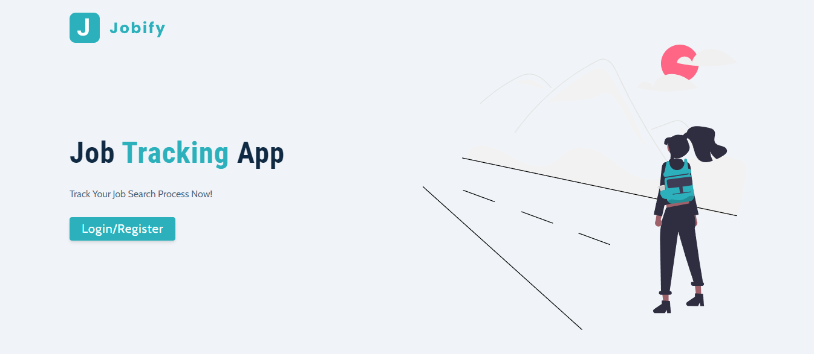
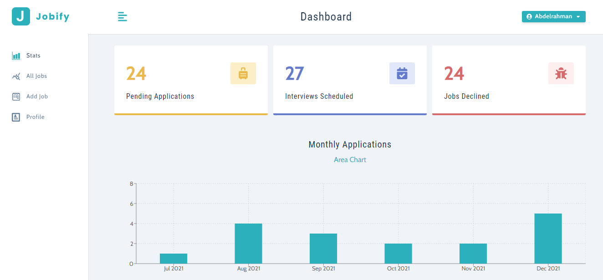
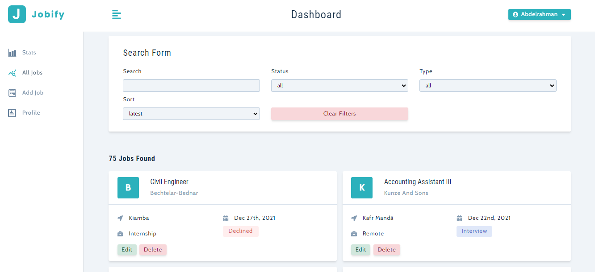

# Jobify

<div id="top"></div>


<!-- PROJECT LOGO -->
<div align="center">
<br>
<a href="https://jobify-abdelrahman-soltan.up.railway.app/">
    
  </a>
<br>
<br>
  
</div>


<!-- ABOUT THE PROJECT -->

## About The Project

MERN Stack Application for tracking Job Search Process





### Features

- Login / Sign-up
- Edit user-data
- Add jobs
- Browse user's jobs with (search + filter) feature
- Display jobs-status + monthly-applications in graphs

### Built With

- React
- React Router
- styled-components
- Node.js
- Express
- MongoDB

### users

| Email                 | Password |
| --------------------- | -------- |
| kiranper123@gmail.com | kiran123   |

#### Validation

- **Email validation**: as per **RFC2822** standards.
- **Password validation**:
  - The password must be more than **6** characters.

<p align="right">(<a href="#top">back to top</a>)</p>

---

<!-- GETTING STARTED -->

## Getting Started

This project require some perquisites and dependencies to be installed, you can find the instructions below

This project require some perquisites and dependencies to be installed, you can view it online using this [demo](https://jobify-abdelrahman-soltan.up.railway.app/). or you can find the instructions below:

> To get a local copy, follow these simple steps :

### Installation

#### installing Locally

1. Clone the repo

   ```sh
   git clone [https://github.com/krnkiran22/Job-application-tracker.git]
   ```

2. go to project folder

   ```sh
   cd jobify
   ```

3. install dependencies

   ```bash
   npm run install
   ```

4. Environmental Variables Set up

   - Here are the environmental variables that needs to be set in the `.env` file in the **server directory**.
   - These are the default setting that I used for development, but you can change it to what works for you.

   ```
     PORT=5000
     MONGO_URL=<Your mongodb url>
     JWT_LIFETIME=1d
     JWT_SECRET=<any secret value of your choice>
   ```

5. Run development server

   ```sh
   npm start
   ```

---

### Ports and EndPoints

#### Ports

- FrontEnd Development Server runs on port `3000`
- BackEnd Development Server runs on port `5000`

#### API endpoints

**Main URL**: [http://localhost:5000/api/v1](http://localhost:5000/api/v1)

- **Auth**

  - Register User: [http://localhost:5000/api/v1/auth/register](http://localhost:5000/api/v1/auth/register) [POST]
  - Login User: [http://localhost:5000/api/v1/auth/login](http://localhost:5000/api/v1/auth/login) [POST]
  - Update User: [http://localhost:5000/api/v1/auth/updateUser](http://localhost:5000/api/v1/auth/updateUser) [PATCH]

- **Jobs**

  - Get all jobs: [http://localhost:5000/api/v1/jobs?status=all&jobType=all&page=1](http://localhost:5000/api/v1/jobs?status=all&jobType=all&page=1) [GET]
  - Create job: [http://localhost:5000/api/v1/jobs](http://localhost:5000/api/v1/jobs) [POST]
  - Update job: [http://localhost:5000/api/v1/jobs/:id](http://localhost:5000/api/v1/jobs/:id) [PATCH]
  - Delete job: [http://localhost:5000/api/v1/jobs/:id](http://localhost:5000/api/v1/jobs/:id) [DELETE]
  - Get stats: [http://localhost:5000/api/v1/jobs/stats](http://localhost:5000/api/v1/jobs/stats) [Get]

[](https://app.getpostman.com/run-collection/f6f7d32b31857f0d5bc9?action=collection%2Fimport)

<p align="right">(<a href="#top">back to top</a>)</p>

---


<p align="right">(<a href="#top">back to top</a>)</p>
